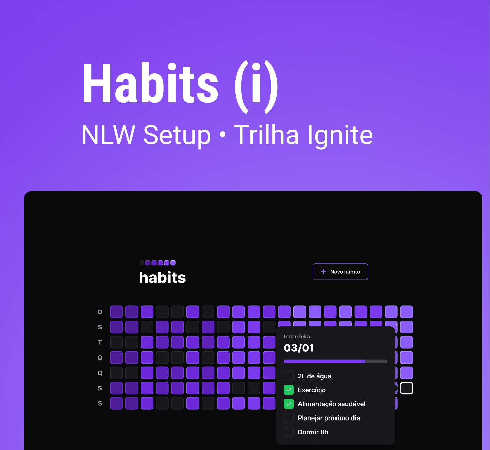

# Habits

Application developed during the NLW week, offered by [Rocketseat](https://www.rocketseat.com.br/).

I followed the front-end and back-end parts, where I can have my first contact with react.

The application developed was intended to generate a control flow of daily habits, where we can register new ones and monitor them.

## Environment Variables

To run this project, you will need to add the following environment variables to your .env file:

`DATABASE_URL="file:./dev.db"`
## Run Locally

Clone the project

```bash
  git clone https://github.com/jonathannrocha/nlw-setup-habits.git
```

Go to the project directory

```bash
  cd habits
```

Install the dependencies of each application

```bash
  cd server
  npm install
```

```bash
  cd web
  npm install
```

Start the server and web application using:

```bash
  npm run dev
```


## Authors

- [@jonathannrocha](https://github.com/jonathannrocha)

## Instructors

- [@diego3g](https://github.com/diego3g)
- [@rodrigorgtic](https://github.com/rodrigorgtic)